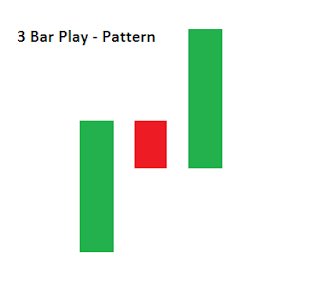

# Three Bar Play Stock Trading Bot

### Powered by AWS and Alpaca

## Strategy 
This repo contains automated trading bot code that searches for simple Three-Bar-Play trade opportunities at market open and logs a message when it's found one. A **Three Bar Play** describes an event in which the time data of a particular stock exhibits an **igniting bar**, followed by a **resting bar**, and then an **entry bar** - the signal its time to buy. Each bar represents a snapshot of stock price data at a particular time interval, in this case I'm using 1, 3, and 5 minute windows. The pattern can also be extended to a **Four Bar Play** by adding another **resting bar**.

## Implementation Details 
The bot subscribes to a web socket that provides by-the-minute stock price data, and those 1 minute snapshots are maintained in a queue. After each data snapshot is received, the data in the queue is evaluated with respect to 1, 3, and 5 minute time sequences to see if any Three Bar Play bar sequences are present. If so, we've found a trading opportunity.

--- 
 

The Three-Bar-Play bot code is encapsulated in a Docker container, and stored in AWS's Elastic Container Registry. An ECS task definition with a Fargate launch type is created that configures the container's resource information and enables the container to be run, starting up the bot. An AWS Step Function that operates on a cron schedule then invokes the Fargate task and executes the container each morning. Other infrastucture resources that support the trading stack such as subnets and route tables are described in the [infrastructure stack.](https://github.com/brockwade633/trading_infra)  

--- 

Subscribing to stock market data and handling the trading operations are supported by [Alpaca - commission free stock trading API.](https://alpaca.markets/) It is a fantastic platform with great API capabilities as well as market data, paper (fake) trading and much more.  

## Next Steps
- Targeting specific stocks from some kind of watch list, and subscribing only to those data streams. This will help improve the likelihood of finding trading opportunities.
- Actually implementing the buy - sell execution flow. This is the biggest function missing from the bot. Now that the infrastructure is in place, all thats needed is to add the logic in code.
- Add new strategies to the Fargate cluster. A nice way to take advantage of Fargate's capabilities would be to scale up the cluster by adding new container task definitions to it, each one encapsulating its own trading strategy and able to be independently executed. Then all the strategy containers could run in parallel. Of course, Alpaca's API request limitations would have to be taken into account here also.